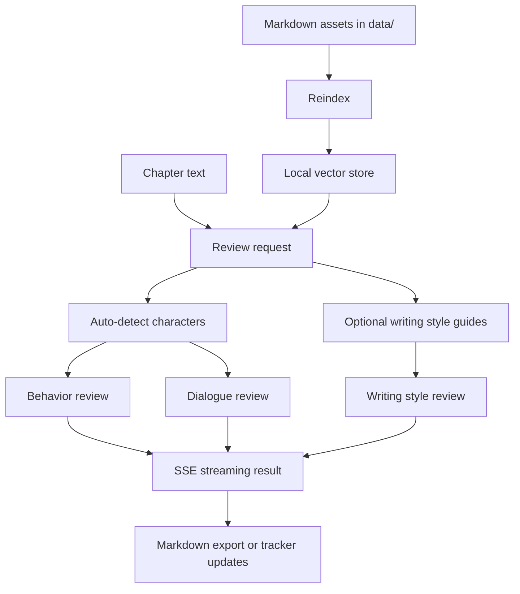

# Novel Assistant

[](https://github.com/easonchiang07-ship-it/novel-assistant/actions/workflows/ci.yml)
[](LICENSE)

English | [繁體中文](README.zh-TW.md)

Novel Assistant is a local AI writing studio for long-form fiction, built with Go and Ollama.

**Anyone — with no technical background — can install the tool, build their story world, generate a full draft, review it, and revise it into something they love. No cloud. No subscriptions. No coding.**

It runs entirely on your machine. Your manuscript never leaves your computer.

## Why This Project Exists

Most writing tools are either:

- general-purpose chat interfaces with little story memory, or
- planning tools without local AI review workflows.

Novel Assistant combines both directions:

- `novelWriter / Manuskript` inspired workflow structure for characters, worldbuilding, relationships, timelines, and foreshadowing
- `AnythingLLM` inspired local knowledge-base behavior for retrieval-assisted review

## Highlights

- Character behavior review with streaming output
- Dialogue style review per character
- Writing style review with reusable `data/style/*.md` profiles
- Rewrite modes with history-aware diff view
- Chapter overview with review counts, tracker signals, and candidate extraction
- Project settings page for Ollama URL, models, defaults, and backups
- Relationship, timeline, and foreshadow trackers
- Local vector indexing for story context retrieval
- Markdown export for review reports
- Chapter bundle export with review, rewrite, timeline, foreshadow, and relationship context
- Local backup / restore for `data/`
- Local-first design using Ollama and file-based project assets

## Review Flow



## Project Status

Current status: active early-stage project, ready for local use and open-source iteration.

What is already solid:

- Local review workflow
- File-based story asset loading
- Unit tests, API-level e2e coverage, and CI
- Tracker pages and export flow

What is still evolving:

- More advanced manuscript editing ergonomics
- Richer publishing assets and screenshots
- Additional import / export formats

See [docs/ROADMAP.md](docs/ROADMAP.md) for planned work.

## Quick Start

### Requirements

- Go `1.21+`
- [Ollama](https://ollama.com/) running locally for native `go run ./cmd`
- Docker + Docker Compose for the container flow

### Run Locally

```bash
go mod tidy
go run ./cmd
```

Open `http://localhost:8080`.
Before your first review request, make sure Ollama already has `llama3.2` and `nomic-embed-text` available, for example with `ollama pull llama3.2` and `ollama pull nomic-embed-text`.

### Environment Configuration

Copy `.env.example` to `.env` and adjust values if needed:

```bash
cp .env.example .env
```

Supported variables:

- `OLLAMA_URL`
- `LLM_MODEL`
- `EMBED_MODEL`
- `DATA_DIR`
- `PORT`

### Docker Compose

```bash
docker compose up --build
```

This starts:

- `app`: the Go web server
- `ollama`: a local Ollama container
- `ollama-init`: a one-shot setup container that pulls required models if they are missing

The compose file expects a local `.env` file and mounts `./data` for persistence.
The `app` container waits for Ollama's health check to pass before starting, so your first reindex is less likely to fail on a cold boot.
On the first startup, `ollama-init` waits for Ollama and then automatically pulls `llama3.2` and `nomic-embed-text`. Later runs skip the pull when those models already exist in the shared Ollama volume.

### Common Development Commands

PowerShell:

```powershell
./scripts/dev.ps1 fmt
./scripts/dev.ps1 test
./scripts/dev.ps1 build
./scripts/dev.ps1 run
```

## Data Layout

Story assets live in the repository as simple files:

```text
data/
├── backups/         # local snapshots created from the settings page
├── characters/      # character profiles in Markdown
├── worldbuilding/   # world notes in Markdown
├── style/           # writing style guides in Markdown
├── chapters/        # optional chapter source files
└── exports/         # generated review reports
```

Generated local state is intentionally ignored from Git:

- `data/store.json`
- `data/relationships.json`
- `data/timeline.json`
- `data/foreshadow.json`
- generated files under `data/exports/`

## File Formats

### Character Profile

```markdown
# 角色：角色名稱
- 個性：...
- 核心恐懼：...
- 行為模式：...
- 弱點：...
- 成長限制：...
- 說話風格：...
```

### Writing Style Guide

```markdown
# 風格：你的風格名稱
- 敘事視角：...
- 句式風格：...
- 節奏感：...
- 語氣：...
- 禁忌：...
```

Built-in examples:

- `data/style/主線敘事.md`
- `data/style/回憶場景.md`

## Recommended Workflow

1. Maintain character, worldbuilding, and style files under `data/`
2. Click `重新索引` to rebuild the local knowledge base
3. Use `Chapter Overview` to inspect chapter counts, unresolved signals, and draft candidates
4. Review or rewrite a single chapter from the review page
5. Inspect rewrite diffs and history before saving a new chapter version
6. Export a full chapter bundle or update relationship, timeline, and foreshadow trackers

## New Workflow Pages

- `Chapter Overview`: chapter counts, tracker summaries, candidate extraction, and chapter bundle export
- `History`: grouped review / rewrite history with export, delete, diff view, and send-back-to-editor flow
- `Settings`: Ollama and model settings, default review rules, `.env`-friendly project values, and backup / restore

## Architecture

High-level architecture notes live in [docs/ARCHITECTURE.md](docs/ARCHITECTURE.md).

Core packages:

- `internal/profile`: loads Markdown-based project assets
- `internal/embedder`: calls Ollama embeddings
- `internal/vectorstore`: stores vectors locally with cosine similarity
- `internal/checker`: streams review output from Ollama
- `internal/tracker`: manages relationship, timeline, and foreshadow state
- `internal/server`: serves the web UI and APIs

## Examples

Example files for onboarding and demos live in [examples/README.md](examples/README.md).

## Troubleshooting

- VSCode shows red errors but `go test` and `go build` pass:
  Open the `novel-assistant` folder directly in VSCode, not the outer `gopl.io` workspace.
- Docker starts but review requests fail:
  Make sure the Ollama container is healthy. On first startup, wait for `ollama-init` to finish pulling the required models.
- `寫作風格` has no selectable items:
  Add `.md` files under `data/style/` and reindex.
- Review requests fail immediately:
  Verify Ollama is running locally and the configured models exist.
- Writing style review returns a validation error:
  Make sure the selected style file exists, is not empty, and includes a `# 風格：...` heading.
- Restored backup looks stale:
  Restore the backup, then click `重新索引` to rebuild vector state from restored assets.

## Privacy Notes

- This project is designed for local-first usage.
- Review your sample manuscript and story data before pushing anything to a public repository.
- Demo data in this repository should stay generic and non-sensitive.

## Contributing

Contributions are welcome.

Start here:

- [CONTRIBUTING.md](CONTRIBUTING.md)
- [docs/DEVELOPMENT_WORKFLOW.md](docs/DEVELOPMENT_WORKFLOW.md)
- [CODE_OF_CONDUCT.md](CODE_OF_CONDUCT.md)
- [SECURITY.md](SECURITY.md)

## Changelog

See [CHANGELOG.md](CHANGELOG.md).

## Release Checklist

For public releases, screenshot refreshes, and repo asset updates, use [docs/RELEASE_ASSET_CHECKLIST.md](docs/RELEASE_ASSET_CHECKLIST.md).

## Planning Docs

- [docs/ROADMAP.md](docs/ROADMAP.md)
- [docs/BACKLOG.md](docs/BACKLOG.md)
- [docs/GITHUB_ISSUES.md](docs/GITHUB_ISSUES.md)
- [docs/DEVELOPMENT_WORKFLOW.md](docs/DEVELOPMENT_WORKFLOW.md)

## Release Notes

Current release notes:

- [v0.1.0](docs/releases/v0.1.0.md)
- [v0.2.0 draft](docs/releases/v0.2.0.md)

## License

Released under the [MIT License](LICENSE).
