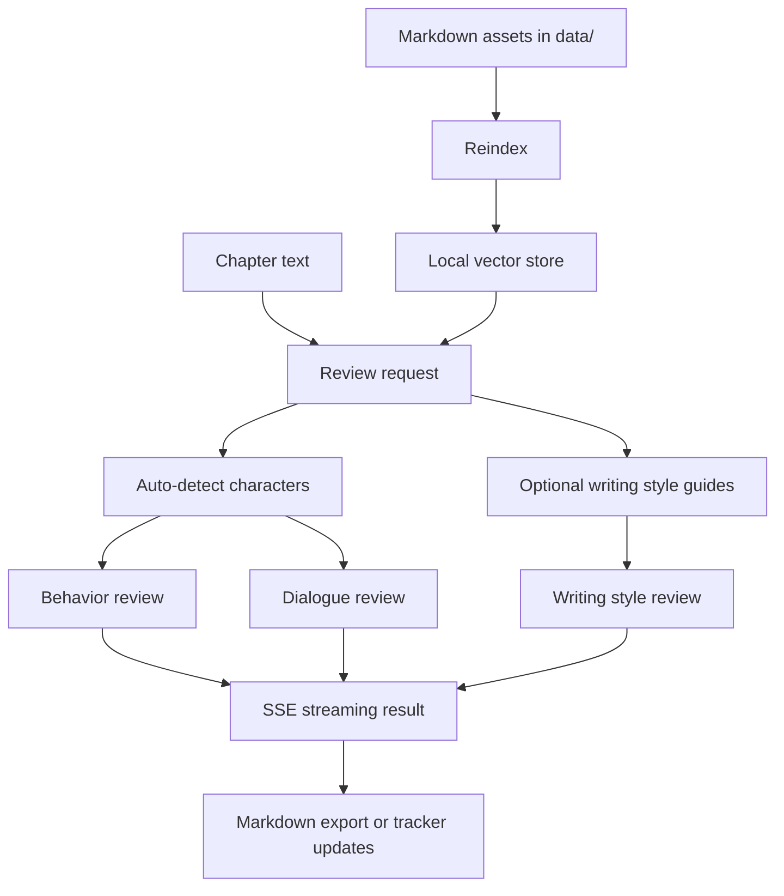

# Novel Assistant

[](https://github.com/easonchiang07-ship-it/novel-assistant/actions/workflows/ci.yml)
[](LICENSE)

English | [繁體中文](README.zh-TW.md)

Novel Assistant is a local-first AI writing companion for long-form fiction, built with Go and Ollama.

It is designed for authors who want help reviewing character behavior, dialogue, narrative style, story structure, and unresolved foreshadowing without sending manuscript data to a cloud service.

## Why This Project Exists

Most writing tools are either:

- general-purpose chat interfaces with little story memory, or
- planning tools without local AI review workflows.

Novel Assistant combines both directions:

- `novelWriter / Manuskript` inspired workflow structure for characters, worldbuilding, relationships, timelines, and foreshadowing
- `AnythingLLM` inspired local knowledge-base behavior for retrieval-assisted review

## Highlights

- Character behavior review with streaming output
- Dialogue style review per character
- Writing style review with reusable `data/style/*.md` profiles
- Relationship, timeline, and foreshadow trackers
- Local vector indexing for story context retrieval
- Markdown export for review reports
- Local-first design using Ollama and file-based project assets

## Review Flow



## Project Status

Current status: active early-stage project, ready for local use and open-source iteration.

What is already solid:

- Local review workflow
- File-based story asset loading
- Basic tests and CI
- Tracker pages and export flow

What is still evolving:

- Richer citation display for retrieved context
- Scene and chapter file management
- More complete release process and packaging

See [docs/ROADMAP.md](docs/ROADMAP.md) for planned work.

## Quick Start

### Requirements

- Go `1.21+`
- [Ollama](https://ollama.com/) running locally

### Install Models

```bash
ollama pull llama3.2
ollama pull nomic-embed-text
```

### Run Locally

```bash
go mod tidy
go run ./cmd
```

Open `http://localhost:8080`.

### Common Development Commands

PowerShell:

```powershell
./scripts/dev.ps1 fmt
./scripts/dev.ps1 test
./scripts/dev.ps1 build
./scripts/dev.ps1 run
```

## Data Layout

Story assets live in the repository as simple files:

```text
data/
├── characters/      # character profiles in Markdown
├── worldbuilding/   # world notes in Markdown
├── style/           # writing style guides in Markdown
├── chapters/        # optional chapter source files
└── exports/         # generated review reports
```

Generated local state is intentionally ignored from Git:

- `data/store.json`
- `data/relationships.json`
- `data/timeline.json`
- `data/foreshadow.json`
- generated files under `data/exports/`

## File Formats

### Character Profile

```markdown
# 角色：角色名稱
- 個性：...
- 核心恐懼：...
- 行為模式：...
- 弱點：...
- 成長限制：...
- 說話風格：...
```

### Writing Style Guide

```markdown
# 風格：你的風格名稱
- 敘事視角：...
- 句式風格：...
- 節奏感：...
- 語氣：...
- 禁忌：...
```

Built-in examples:

- `data/style/主線敘事.md`
- `data/style/回憶場景.md`

## Recommended Workflow

1. Maintain character, worldbuilding, and style files under `data/`
2. Click `重新索引` to rebuild the local knowledge base
3. Paste a single chapter or scene into the review page
4. Select behavior, dialogue, and optional writing-style review scopes
5. Export the review or update relationship, timeline, and foreshadow trackers

## Architecture

High-level architecture notes live in [docs/ARCHITECTURE.md](docs/ARCHITECTURE.md).

Core packages:

- `internal/profile`: loads Markdown-based project assets
- `internal/embedder`: calls Ollama embeddings
- `internal/vectorstore`: stores vectors locally with cosine similarity
- `internal/checker`: streams review output from Ollama
- `internal/tracker`: manages relationship, timeline, and foreshadow state
- `internal/server`: serves the web UI and APIs

## Examples

Example files for onboarding and demos live in [examples/README.md](examples/README.md).

## Troubleshooting

- VSCode shows red errors but `go test` and `go build` pass:
  Open the `novel-assistant` folder directly in VSCode, not the outer `gopl.io` workspace.
- `寫作風格` has no selectable items:
  Add `.md` files under `data/style/` and reindex.
- Review requests fail immediately:
  Verify Ollama is running locally and the configured models exist.
- Writing style review returns a validation error:
  Make sure the selected style file exists, is not empty, and includes a `# 風格：...` heading.

## Privacy Notes

- This project is designed for local-first usage.
- Review your sample manuscript and story data before pushing anything to a public repository.
- Demo data in this repository should stay generic and non-sensitive.

## Contributing

Contributions are welcome.

Start here:

- [CONTRIBUTING.md](CONTRIBUTING.md)
- [CODE_OF_CONDUCT.md](CODE_OF_CONDUCT.md)
- [SECURITY.md](SECURITY.md)

## Changelog

See [CHANGELOG.md](CHANGELOG.md).

## Release Notes

Current release notes:

- [v0.1.0](docs/releases/v0.1.0.md)

## License

Released under the [MIT License](LICENSE).
