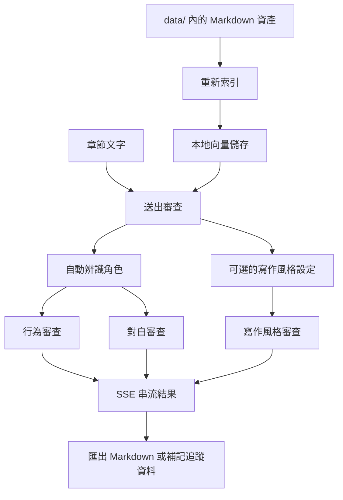

# Novel Assistant

[](https://github.com/easonchiang07-ship-it/novel-assistant/actions/workflows/ci.yml)
[](LICENSE)

[English](README.md) | 繁體中文

Novel Assistant 是一款專為長篇小說設計的本地 AI 寫作工作室，以 Go 與 Ollama 為基礎打造。

**任何人，不需要任何技術背景，只要安裝好工具，就能建立自己的故事世界、生成草稿、審查、一步一步修成自己喜歡的模樣。不需要雲端、不需要訂閱、不需要寫程式。**

全程在你的電腦上執行。你的稿件永遠不會離開你的裝置。

## 這個專案想解決什麼

多數寫作工具通常落在兩端：

- 通用聊天介面，對故事上下文記憶很弱
- 有規劃能力的寫作工具，但沒有本地 AI 審查流程

Novel Assistant 想把兩者結合：

- 借鏡 `novelWriter / Manuskript` 的寫作工作流，把角色、世界觀、關係、時間軸與伏筆整理成可維護的資產
- 借鏡 `AnythingLLM` 的本地知識庫思路，讓審查時能帶入檢索到的故事上下文

## 核心功能

- 角色行為一致性審查
- 角色對白風格審查
- 可重複使用的 `data/style/*.md` 寫作風格審查
- 修稿模式與歷史 diff 差異比較
- 章節總覽、審查次數、候選訊號與草稿建立
- 專案設定頁，可管理 Ollama、模型、預設審查與備份
- 關係圖、時間軸、伏筆追蹤
- 本地向量索引與 RAG 上下文提示
- Markdown 審查報告匯出
- 單章完整報告匯出，整合審查 / 修稿 / 時間軸 / 伏筆 / 關係
- `data/` 備份與還原
- 本地優先，搭配 Ollama 與檔案式故事資產

## 審查流程



## 專案狀態

目前狀態：已可本地使用，並適合作為開源專案持續迭代。

目前較穩定的部分：

- 本地審查主流程
- 檔案式故事資產載入
- 單元測試、API 級 e2e 測試與 CI
- 追蹤頁面與匯出流程

持續演進中的部分：

- 更進階的編輯體驗
- 更完整的展示素材與專案首頁視覺
- 更多匯入 / 匯出格式

後續規劃可參考 [docs/ROADMAP.md](docs/ROADMAP.md)。

## 快速開始

### 環境需求

- Go `1.21+`
- 本地執行中的 [Ollama](https://ollama.com/)

### 安裝模型

```bash
ollama pull llama3.2
ollama pull nomic-embed-text
```

### 啟動專案

```bash
go mod tidy
go run ./cmd
```

啟動後開啟 `http://localhost:8080`。

### 環境變數設定

可將 `.env.example` 複製成 `.env` 後再啟動：

```bash
cp .env.example .env
```

支援的變數有：

- `OLLAMA_URL`
- `LLM_MODEL`
- `EMBED_MODEL`
- `DATA_DIR`
- `PORT`

### Docker Compose

```bash
docker compose up --build
```

這會啟動：

- `app`：Go 網頁伺服器
- `ollama`：本地 Ollama 容器

`docker-compose.yml` 會讀取本地 `.env`，並將 `./data` 掛載成持久化資料目錄。

### 常用開發指令

PowerShell：

```powershell
./scripts/dev.ps1 fmt
./scripts/dev.ps1 test
./scripts/dev.ps1 build
./scripts/dev.ps1 run
```

## 資料結構

故事資產以簡單檔案形式放在 repo 內：

```text
data/
├── backups/         # 從設定頁建立的本地快照
├── characters/      # 角色設定 Markdown
├── worldbuilding/   # 世界觀 Markdown
├── style/           # 寫作風格 Markdown
├── chapters/        # 可選的章節原始稿
└── exports/         # 匯出的審查報告
```

以下為本地產生資料，預設不納入 Git：

- `data/store.json`
- `data/relationships.json`
- `data/timeline.json`
- `data/foreshadow.json`
- `data/exports/` 內的匯出檔

## 檔案格式

### 角色設定

```markdown
# 角色：角色名稱
- 個性：...
- 核心恐懼：...
- 行為模式：...
- 弱點：...
- 成長限制：...
- 說話風格：...
```

### 寫作風格設定

```markdown
# 風格：你的風格名稱
- 敘事視角：...
- 句式風格：...
- 節奏感：...
- 語氣：...
- 禁忌：...
```

內建範例：

- `data/style/主線敘事.md`
- `data/style/回憶場景.md`

## 建議使用方式

1. 在 `data/` 下維護角色、世界觀與風格設定
2. 點擊 `重新索引` 建立本地知識庫
3. 在 `章節總覽` 查看字數、審查次數、候選角色 / 設定訊號
4. 在審查頁檢查或修稿單一章節
5. 在 `審查歷史` 看 diff、回填編輯器，決定是否另存新版本
6. 匯出單章完整報告，或把變化補記到關係圖、時間軸與伏筆追蹤

## 主要工作頁

- `章節總覽`：查看章節狀態、候選訊號、完整報告匯出
- `審查歷史`：分章節查看審查 / 修稿紀錄，支援 diff、刪除、匯出、回填
- `規則設定`：集中管理 Ollama、模型、預設審查項目、風格、備份與還原

## 架構說明

高層架構文件請見 [docs/ARCHITECTURE.md](docs/ARCHITECTURE.md)。

核心模組：

- `internal/profile`：載入 Markdown 故事資產
- `internal/embedder`：呼叫 Ollama embeddings
- `internal/vectorstore`：本地向量儲存與 cosine similarity
- `internal/checker`：串流輸出審查結果
- `internal/tracker`：管理關係、時間軸與伏筆
- `internal/server`：提供 UI 與 HTTP API

## 範例

示範內容與 onboarding 檔案放在 [examples/README.md](examples/README.md)。

## 疑難排解

- VSCode 顯示紅字，但 `go test` 和 `go build` 都正常：
  請直接用 VSCode 開 `novel-assistant` 資料夾，不要開外層 `gopl.io` workspace。
- Docker 可以啟動，但審查送出失敗：
  請確認 Ollama 容器已正常啟動，且所需模型已先 pull。
- `寫作風格` 沒有可選項目：
  請確認 `data/style/` 內已有 `.md` 檔案，並重新索引。
- 審查一送出就失敗：
  請確認 Ollama 已在本地執行，且需要的模型已安裝。
- 寫作風格審查出現驗證錯誤：
  請確認所選風格檔存在、內容不為空，且包含 `# 風格：...` 標題。
- 還原備份後結果看起來不對：
  還原完成後請再點一次 `重新索引`，讓向量索引與資料快照重新同步。

## 隱私說明

- 本專案以本地使用為核心。
- 若要公開 repo，請先檢查是否誤提交私人稿件或故事資料。
- repo 內的示範內容應維持通用且不敏感。

## 參與貢獻

歡迎貢獻。

入口文件：

- [CONTRIBUTING.md](CONTRIBUTING.md)
- [docs/DEVELOPMENT_WORKFLOW.md](docs/DEVELOPMENT_WORKFLOW.md)
- [CODE_OF_CONDUCT.md](CODE_OF_CONDUCT.md)
- [SECURITY.md](SECURITY.md)

## 變更紀錄

請見 [CHANGELOG.md](CHANGELOG.md)。

## Release Checklist

若要整理公開 release、更新 screenshots 或刷新 repo 資產，請依照 [docs/RELEASE_ASSET_CHECKLIST.md](docs/RELEASE_ASSET_CHECKLIST.md) 執行。

## 規劃文件

- [docs/ROADMAP.md](docs/ROADMAP.md)
- [docs/BACKLOG.md](docs/BACKLOG.md)
- [docs/GITHUB_ISSUES.md](docs/GITHUB_ISSUES.md)
- [docs/DEVELOPMENT_WORKFLOW.md](docs/DEVELOPMENT_WORKFLOW.md)

## Release Notes

目前版本說明：

- [v0.1.0](docs/releases/v0.1.0.md)
- [v0.2.0 草稿](docs/releases/v0.2.0.zh-TW.md)

## 授權

本專案採用 [MIT License](LICENSE)。
